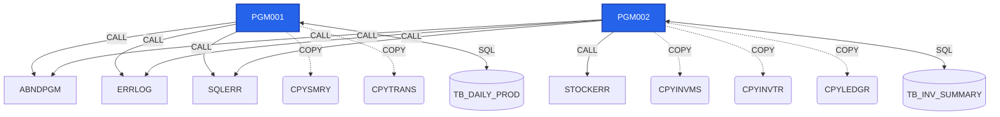

# 프로그램 호출 관계도 (Call Graph)

```mermaid
graph TD
    classDef mainPgm fill:#2563EB,stroke:#1E40AF,color:#fff,stroke-width:2px
    classDef subPgm fill:#059669,stroke:#047857,color:#fff
    classDef copybook fill:#D97706,stroke:#B45309,color:#fff
    classDef db2 fill:#7C3AED,stroke:#6D28D9,color:#fff

    PGM001[PGM001] -->|CALL| ABNDPGM[ABNDPGM]
    PGM001[PGM001] -->|CALL| ERRLOG[ERRLOG]
    PGM001[PGM001] -->|CALL| SQLERR[SQLERR]
    PGM001 -.->|COPY| CPY_CPYSMRY(CPYSMRY)
    PGM001 -.->|COPY| CPY_CPYTRANS(CPYTRANS)
    PGM001 <-->|SQL| DB_TB_DAILY_PROD[(TB_DAILY_PROD)]
    PGM002[PGM002] -->|CALL| ABNDPGM[ABNDPGM]
    PGM002[PGM002] -->|CALL| ERRLOG[ERRLOG]
    PGM002[PGM002] -->|CALL| SQLERR[SQLERR]
    PGM002[PGM002] -->|CALL| STOCKERR[STOCKERR]
    PGM002 -.->|COPY| CPY_CPYINVMS(CPYINVMS)
    PGM002 -.->|COPY| CPY_CPYINVTR(CPYINVTR)
    PGM002 -.->|COPY| CPY_CPYLEDGR(CPYLEDGR)
    PGM002 <-->|SQL| DB_TB_INV_SUMMARY[(TB_INV_SUMMARY)]

    class PGM002 mainPgm
    class PGM001 mainPgm
```
