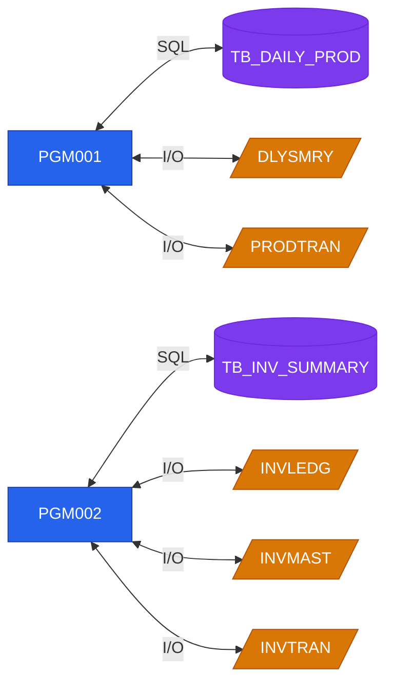

# 데이터 흐름도 (Data Flow)

```mermaid
graph LR
    classDef pgm fill:#2563EB,stroke:#1E40AF,color:#fff
    classDef db fill:#7C3AED,stroke:#6D28D9,color:#fff
    classDef file fill:#D97706,stroke:#B45309,color:#fff

    PGM001[PGM001] <-->|SQL| DB_TB_DAILY_PROD[(TB_DAILY_PROD)]
    class DB_TB_DAILY_PROD db
    PGM001[PGM001] <-->|I/O| F_DLYSMRY[/DLYSMRY/]
    class F_DLYSMRY file
    PGM001[PGM001] <-->|I/O| F_PRODTRAN[/PRODTRAN/]
    class F_PRODTRAN file
    class PGM001 pgm

    PGM002[PGM002] <-->|SQL| DB_TB_INV_SUMMARY[(TB_INV_SUMMARY)]
    class DB_TB_INV_SUMMARY db
    PGM002[PGM002] <-->|I/O| F_INVLEDG[/INVLEDG/]
    class F_INVLEDG file
    PGM002[PGM002] <-->|I/O| F_INVMAST[/INVMAST/]
    class F_INVMAST file
    PGM002[PGM002] <-->|I/O| F_INVTRAN[/INVTRAN/]
    class F_INVTRAN file
    class PGM002 pgm

```
