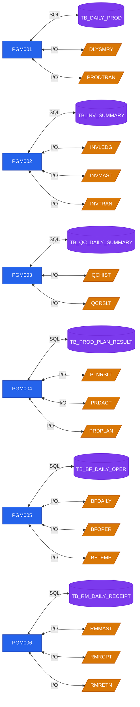

# 데이터 흐름도 (Data Flow)

```mermaid
graph LR
    classDef pgm fill:#2563EB,stroke:#1E40AF,color:#fff
    classDef db fill:#7C3AED,stroke:#6D28D9,color:#fff
    classDef file fill:#D97706,stroke:#B45309,color:#fff

    PGM001[PGM001] <-->|SQL| DB_TB_DAILY_PROD[(TB_DAILY_PROD)]
    class DB_TB_DAILY_PROD db
    PGM001[PGM001] <-->|I/O| F_DLYSMRY[/DLYSMRY/]
    class F_DLYSMRY file
    PGM001[PGM001] <-->|I/O| F_PRODTRAN[/PRODTRAN/]
    class F_PRODTRAN file
    class PGM001 pgm

    PGM002[PGM002] <-->|SQL| DB_TB_INV_SUMMARY[(TB_INV_SUMMARY)]
    class DB_TB_INV_SUMMARY db
    PGM002[PGM002] <-->|I/O| F_INVLEDG[/INVLEDG/]
    class F_INVLEDG file
    PGM002[PGM002] <-->|I/O| F_INVMAST[/INVMAST/]
    class F_INVMAST file
    PGM002[PGM002] <-->|I/O| F_INVTRAN[/INVTRAN/]
    class F_INVTRAN file
    class PGM002 pgm

    PGM003[PGM003] <-->|SQL| DB_TB_QC_DAILY_SUMMARY[(TB_QC_DAILY_SUMMARY)]
    class DB_TB_QC_DAILY_SUMMARY db
    PGM003[PGM003] <-->|I/O| F_QCHIST[/QCHIST/]
    class F_QCHIST file
    PGM003[PGM003] <-->|I/O| F_QCRSLT[/QCRSLT/]
    class F_QCRSLT file
    class PGM003 pgm

    PGM004[PGM004] <-->|SQL| DB_TB_PROD_PLAN_RESULT[(TB_PROD_PLAN_RESULT)]
    class DB_TB_PROD_PLAN_RESULT db
    PGM004[PGM004] <-->|I/O| F_PLNRSLT[/PLNRSLT/]
    class F_PLNRSLT file
    PGM004[PGM004] <-->|I/O| F_PRDACT[/PRDACT/]
    class F_PRDACT file
    PGM004[PGM004] <-->|I/O| F_PRDPLAN[/PRDPLAN/]
    class F_PRDPLAN file
    class PGM004 pgm

    PGM005[PGM005] <-->|SQL| DB_TB_BF_DAILY_OPER[(TB_BF_DAILY_OPER)]
    class DB_TB_BF_DAILY_OPER db
    PGM005[PGM005] <-->|I/O| F_BFDAILY[/BFDAILY/]
    class F_BFDAILY file
    PGM005[PGM005] <-->|I/O| F_BFOPER[/BFOPER/]
    class F_BFOPER file
    PGM005[PGM005] <-->|I/O| F_BFTEMP[/BFTEMP/]
    class F_BFTEMP file
    class PGM005 pgm

    PGM006[PGM006] <-->|SQL| DB_TB_RM_DAILY_RECEIPT[(TB_RM_DAILY_RECEIPT)]
    class DB_TB_RM_DAILY_RECEIPT db
    PGM006[PGM006] <-->|I/O| F_RMMAST[/RMMAST/]
    class F_RMMAST file
    PGM006[PGM006] <-->|I/O| F_RMRCPT[/RMRCPT/]
    class F_RMRCPT file
    PGM006[PGM006] <-->|I/O| F_RMRETN[/RMRETN/]
    class F_RMRETN file
    class PGM006 pgm

```
