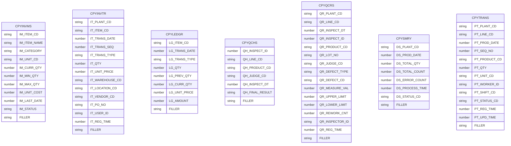

# 데이터 ERD (Entity Relationship Diagram)

```mermaid
erDiagram

    CPYINVMS {
        string IM_ITEM_CD
        string IM_ITEM_NAME
        string IM_CATEGORY
        string IM_UNIT_CD
        number IM_CURR_QTY
        number IM_MIN_QTY
        number IM_MAX_QTY
        number IM_UNIT_COST
        number IM_LAST_DATE
        string IM_STATUS
        string FILLER
    }

    CPYINVTR {
        string IT_PLANT_CD
        string IT_ITEM_CD
        number IT_TRANS_DATE
        number IT_TRANS_SEQ
        string IT_TRANS_TYPE
        number IT_QTY
        number IT_UNIT_PRICE
        string IT_WAREHOUSE_CD
        string IT_LOCATION_CD
        string IT_VENDOR_CD
        string IT_PO_NO
        string IT_USER_ID
        number IT_REG_TIME
        string FILLER
    }

    CPYLEDGR {
        string LG_ITEM_CD
        number LG_TRANS_DATE
        string LG_TRANS_TYPE
        number LG_QTY
        number LG_PREV_QTY
        number LG_CURR_QTY
        number LG_UNIT_PRICE
        number LG_AMOUNT
        string FILLER
    }

    CPYQCHS {
        number QH_INSPECT_ID
        string QH_LINE_CD
        string QH_PRODUCT_CD
        string QH_JUDGE_CD
        number QH_INSPECT_DT
        string QH_FINAL_RESULT
        string FILLER
    }

    CPYQCRS {
        string QR_PLANT_CD
        string QR_LINE_CD
        number QR_INSPECT_DT
        number QR_INSPECT_ID
        string QR_PRODUCT_CD
        string QR_LOT_NO
        string QR_JUDGE_CD
        string QR_DEFECT_TYPE
        string QR_DEFECT_CD
        number QR_MEASURE_VAL
        number QR_UPPER_LIMIT
        number QR_LOWER_LIMIT
        number QR_REWORK_CNT
        string QR_INSPECTOR_ID
        number QR_REG_TIME
        string FILLER
    }

    CPYSMRY {
        string DS_PLANT_CD
        number DS_PROD_DATE
        number DS_TOTAL_QTY
        number DS_TOTAL_COUNT
        number DS_ERROR_COUNT
        number DS_PROCESS_TIME
        string DS_STATUS_CD
        string FILLER
    }

    CPYTRANS {
        string PT_PLANT_CD
        string PT_LINE_CD
        number PT_PROD_DATE
        number PT_SEQ_NO
        string PT_PRODUCT_CD
        number PT_QTY
        string PT_UNIT_CD
        string PT_WORKER_ID
        string PT_SHIFT_CD
        string PT_STATUS_CD
        number PT_REG_TIME
        number PT_UPD_TIME
        string FILLER
    }

```
